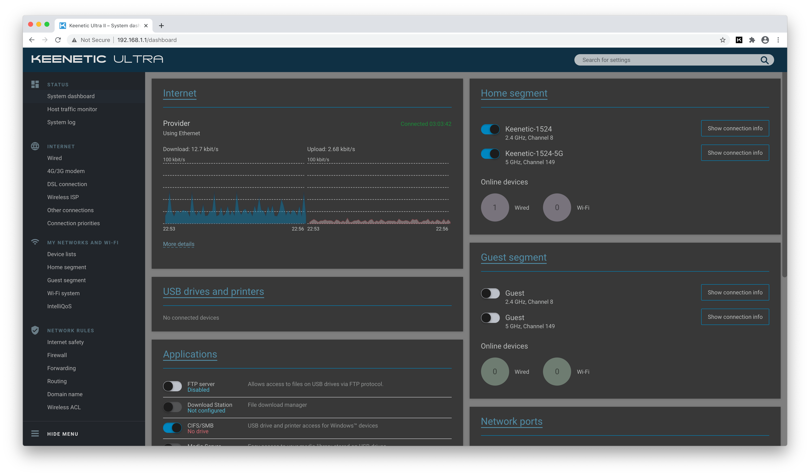

# Keenetic Dark Theme

Dark theme for the web UI of the Keenetic devices



## To build your copy of the extension:

- clone this repository
- install required dependencies (`npm install`)
- modify any extension files as you see fit
- run one of the `npm run build X` scripts (see below)

## Project structure

```
├── app/ - actual webextension code
│   │  
│   │  
│   ├── _locales/                   - l10n data
│   ├── images/                     - extension icons
│   │    
│   │    
│   ├── pages/  
│   │   ├── options.html
│   │   └── popup.html
│   │    
│   │  
│   ├── scripts/  
│   │   ├── lib/                    - utility functions
│   │   ├── uiExtension/            - UI extensions
│   │   ├── background.js           - extension "background page"
│   │   ├── contentscript.js        - JS code that is injected into each browser tab
│   │   ├── injectUiExtensions.js
│   │   ├── main.js                 - JS code that detects firmware version
│   │   ├── options.js              - extension "options page"
│   │   ├── popup.js                - extension "popup" (show when the extension icon is clicked)
│   │   └── webextension-l10n.js    - JS that handles l10n 
│   │    
│   │  
│   ├── styles/                     - folder for generated CSS files
│   │    
│   │  
│   └── mainfest.json               - webextension manifest       
│  
├── theme/ - LESS files
│   │  
│   │  
│   ├── component/                  - component styles (e.g. dropdown menu styles)    
│   ├── page/                       - page-specific styles (e.g. special styles for the dashboard)  
│   ├── uiExtensions/               - styles for UI extensions added by keenetic-dark-theme-extensions  
│   ├── version-specific/           - version specific styles  
│   │
│   ├── __vars__.less               - colors used in the extension    
│   ├── theme-2.x.less              - 2.x firmware theme  
│   ├── theme-3.x.less              - 3.x firmware theme
│   └── theme-general.less          - styles included regardless of the firmware version
│  
│  
├── build-css.js                    - utility npm script that rebuilds theme CSS files
├── build-l10n.js                   - utility npm script that rebuilds l10n.js
│  
└── webextension-toolbox.config.js  - webextension-toolbox configuration
```

## Development build

Run one of the following commands:

    npm run dev chrome
    npm run dev firefox
    npm run dev opera
    npm run dev edge

Then load the extension from the `./dist/{browser}` folder.
It will reload itself automatically on changes to the `./app` folder contents.

## Utility `npm` scripts:

- compile LESS files from `./theme` to CSS files (`./app/styles`)<br/>
  (execute manually after changes to the `./theme` folder files):<br/>
  `npm run build-css`

- rebuild `./app/scripts/lib/l10n.js` file:<br/>
  `npm run build-l10n`

## Production build

Build minified version of the extension & pack it into a ZIP archive:

    npm run build chrome
    npm run build firefox
    npm run build opera
    npm run build edge

Archive contents for the Mozilla Firefox browser
can be signed as an `.xpi` file
via the [`web-ext`](https://github.com/mozilla/web-ext) command line tool.

The `./packages` folder will contain an archive for the browser you've selected.
